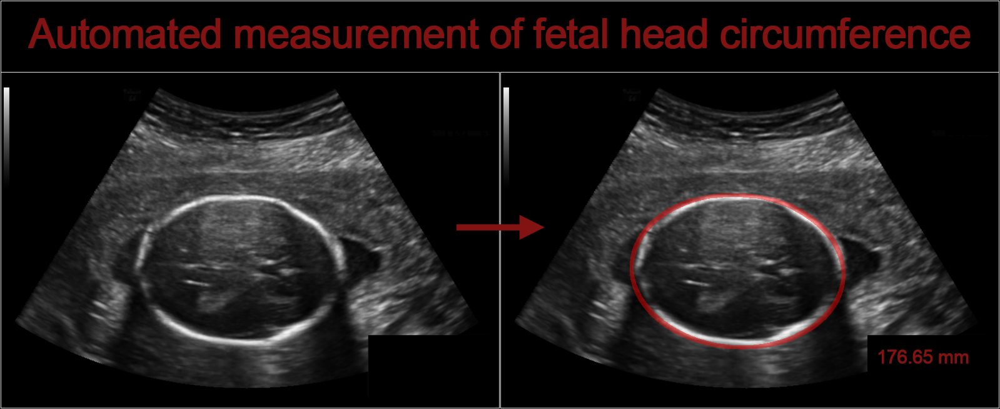
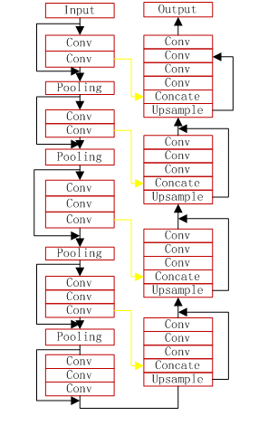
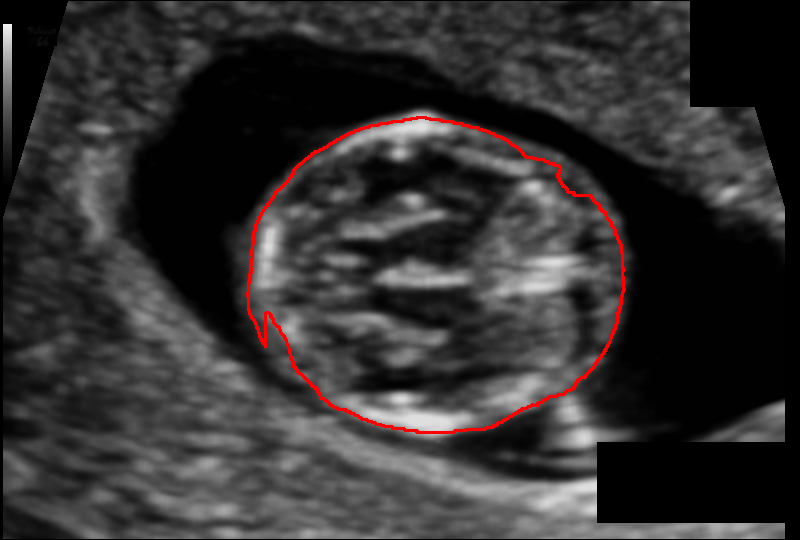
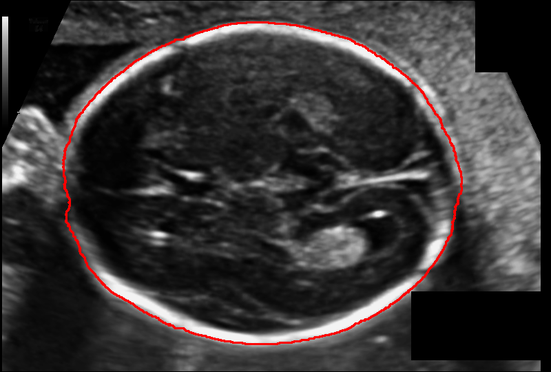
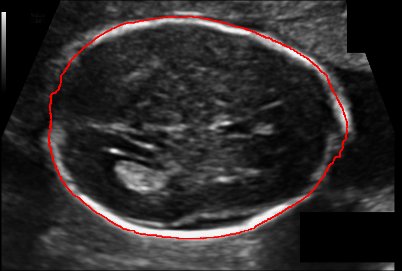

# HC18-Automated-measurement-of-fetal-head-circumference
> This is an example of the ultrasound imaging is used to measure the fetal head circumference (HC).

## How to Use

**1、Preprocess**
* download ultrasound image data:https://zenodo.org/record/1327317
* convert annotation image to mask image,you can download here:
* data augmentation:run the augtest.py

**2、HC Segmentation**
* the VNet2d model

 

* train and predict in the script of vnet2d_train.py and vnet2d_predict.py

**3、trained model can download on here:**

## Result

## Contact
* https://github.com/junqiangchen
* email: 1207173174@qq.com
* Contact: junqiangChen
* WeChat Number: 1207173174
* WeChat Public number: 最新医学影像技术
